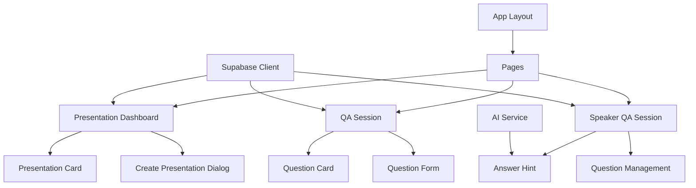

# System Patterns

## System Architecture

MyJoshu follows a modern web application architecture with the following key components:

### Frontend Architecture

1. **Next.js Application**

   - Server-side rendering for improved performance and SEO
   - Client-side interactivity for real-time features
   - App Router for file-based routing and layouts

2. **Component Structure**

   - UI components built with React and Tailwind CSS
   - Separation of concerns between presentation and logic
   - Reusable UI components in the components/ui directory

3. **State Management**
   - React hooks for local component state
   - Server actions for server-side mutations
   - Supabase real-time subscriptions for live updates

### Backend Architecture

1. **Serverless API Routes**

   - Next.js API routes for backend functionality
   - Serverless functions for specific operations (e.g., AI processing)

2. **Database Layer**

   - Supabase PostgreSQL database for data storage
   - Real-time capabilities for live updates
   - Row-level security for data protection

3. **Authentication System**

   - Supabase Auth for user authentication
   - Support for both registered users and anonymous access
   - Role-based access control (speakers vs. attendees)

4. **AI Integration**
   - Google Gemini API for generating answer hints
   - Asynchronous processing to avoid blocking the UI
   - Context-aware responses based on presentation content

## Key Technical Decisions

1. **Next.js Framework**

   - Provides both frontend and backend capabilities
   - Server components for improved performance
   - Built-in API routes for backend functionality

2. **Supabase as Backend Service**

   - PostgreSQL database with real-time capabilities
   - Built-in authentication and authorization
   - Simplified database operations with client libraries

3. **Tailwind CSS for Styling**

   - Utility-first approach for rapid UI development
   - Consistent design system across the application
   - Responsive design out of the box

4. **Google Gemini for AI**
   - Advanced language model for generating contextual hints
   - Efficient API for real-time processing
   - Customizable prompts for specific use cases

## Design Patterns

### Frontend Patterns

1. **Component Composition**

   - Building complex UIs from smaller, reusable components
   - Example: UI components like Button, Card, Dialog are composed into larger features

2. **Container/Presentation Pattern**

   - Separation between data fetching/logic and presentation
   - Example: PresentationDashboard handles state while UI components handle rendering

3. **Server Actions**

   - Server-side mutations with client-side form integration
   - Example: createPresentation action for creating new presentations

4. **Real-time Subscriptions**
   - Subscribing to database changes for live updates
   - Example: QASession component subscribes to new questions

### Backend Patterns

1. **API Route Handlers**

   - Dedicated handlers for specific API endpoints
   - Example: answerHints route for generating and retrieving hints

2. **Database Migrations**

   - Versioned schema changes for database evolution
   - Example: Migration files in supabase/migrations

3. **Authentication Middleware**

   - Protecting routes based on authentication status
   - Example: Redirecting unauthenticated users from protected pages

4. **Service Pattern**
   - Encapsulating external service interactions
   - Example: AI service for generating answer hints

## Component Relationships

### Key Component Interactions

1. **Presentation Creation Flow**

   - User interacts with PresentationDashboard
   - Creates new presentation via PresentationFileUploader
   - Server action processes the creation
   - Real-time update reflects the new presentation

2. **Q&A Session Flow**

   - Attendee accesses QASession via QR code
   - Submits questions through question form
   - Real-time channel broadcasts the question
   - Speaker sees the question in SpeakerQASession

3. **Answer Hint Generation Flow**
   - Speaker selects a question in SpeakerQASession
   - Request is sent to answerHints API
   - Gemini API generates contextual hints
   - Hints are displayed to the speaker via AnswerHint component
